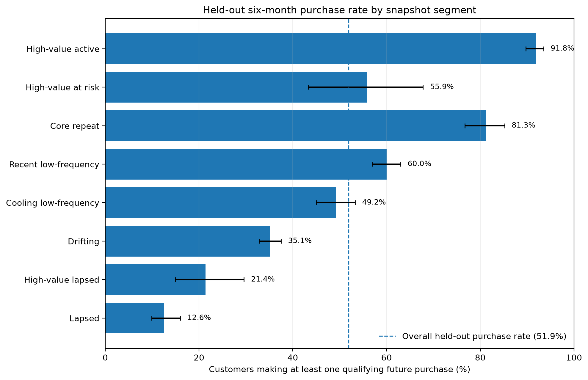
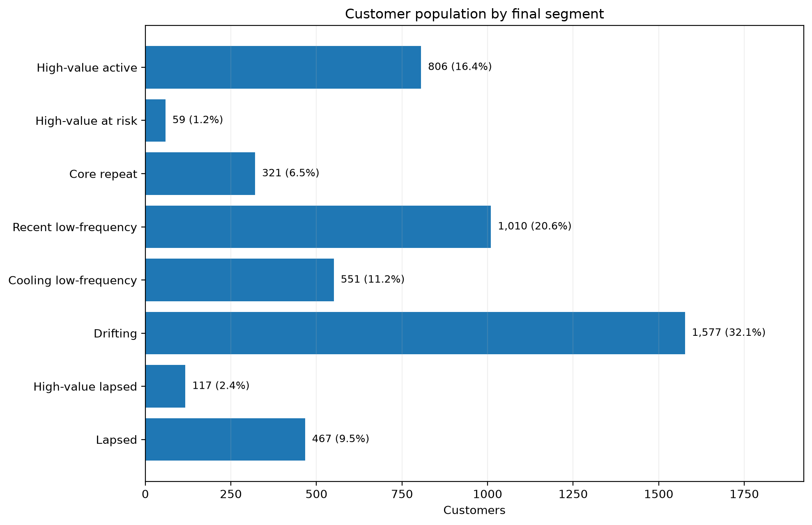
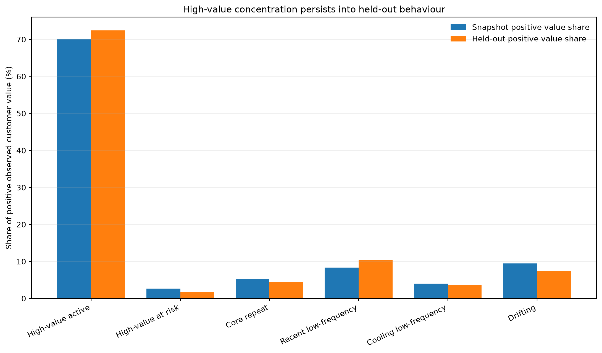
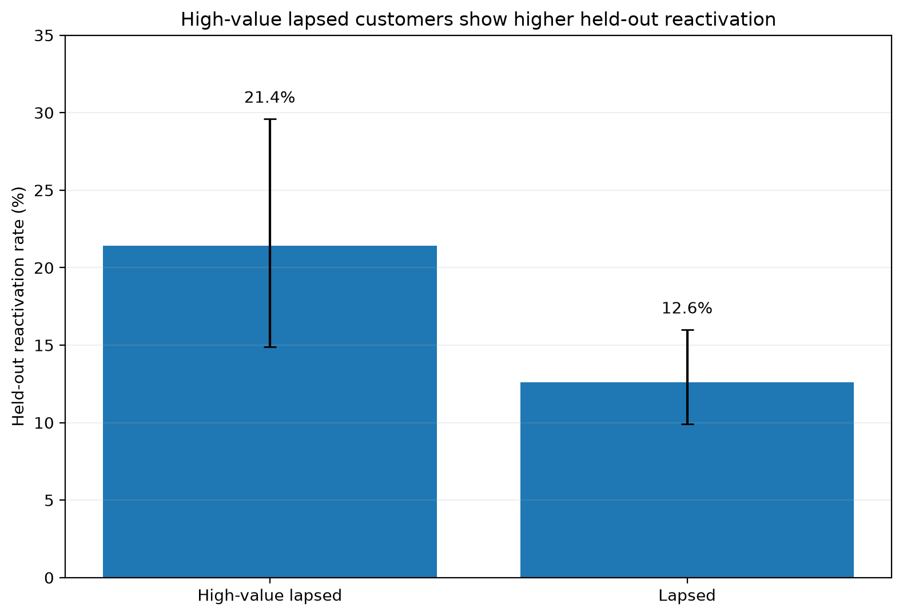

# Project 03: Customer Value & Retention Segmentation

A customer segmentation project for a UK online retailer, using Python and SQL to turn transaction history into actionable retention, growth and reactivation priorities.

Segments are defined at a fixed historical snapshot and then tested against six months of purchasing behaviour that was deliberately withheld from segment construction.

## Business question

**Which customer groups should a CRM or Customer Insight Manager prioritise for different retention, reactivation and growth activity based on recent purchasing value and behaviour?**

## Headline findings

The final segmentation contains **4,908 customers across eight mutually exclusive groups**.

The held-out validation shows strong behavioural differentiation:

* **High-value active:** 91.8% purchased again; this group contains 16.4% of customers but generated **71.7% of positive held-out customer value**.
* **Core repeat:** 81.3% purchased again.
* **Recent low-frequency:** 60.0% purchased again.
* **Cooling low-frequency:** 49.2% purchased again.
* **Drifting:** 35.1% purchased again.
* **High-value lapsed:** 21.4% reactivated versus 12.6% for other lapsed customers.

The results support different CRM priorities rather than a one-size-fits-all retention strategy.



## Analytical design

The analysis uses **Online Retail II** from the UCI Machine Learning Repository.

The time design is deliberately fixed before analysis:

* **snapshot:** 31 May 2011;
* **behavioural window:** 1 June 2010 to 31 May 2011;
* **held-out validation:** 1 June to 30 November 2011.

Validation-period behaviour cannot influence segment definitions.

This is not presented as churn modelling or customer lifetime value analysis. The data supports finite-window measures of **observed customer value** and subsequent purchasing behaviour.

## Data foundation

The source workbook contains two annual worksheets with overlapping coverage in December 2010.

Direct comparison established **22,523 rows of duplicate cross-sheet source coverage**. The corrected source retains the earlier worksheet in full and appends only later records after its final timestamp.

The validated combined source contains:

* **1,044,848 transaction rows**;
* **235,287 rows without Customer ID**;
* **11,812 excess exact duplicate rows** within the retained source;
* **22,557 negative-quantity rows**;
* **6,024 zero-price rows**;
* **5 negative-price rows**.

Exact within-sheet duplicates are retained because the dataset has no transaction-line identifier capable of distinguishing an erroneous duplicate from legitimate repeated identical lines.

A later sensitivity analysis confirms that removing all 11,812 rows changes only **6 of 4,908 segment assignments (0.12%)**.

Full decisions are documented in [`docs/data_quality_and_cleaning_decisions.md`](docs/data_quality_and_cleaning_decisions.md).

## Transaction cleaning

The Python cleaning pipeline:

* preserves all 1,044,848 rows from the corrected source;
* retains raw fields alongside normalised analytical fields;
* explicitly labels behavioural and validation periods;
* separates merchandise, returns, Manual entries, postage, discounts and administrative/accounting activity;
* treats customer activity, observed net sales and product breadth as different analytical concepts;
* retains missing-ID transactions for reconciliation but excludes them from customer-level measures;
* ends with **zero unresolved transaction classifications**.

After classification, **15.0% of positive classified transaction value cannot be attributed to an identifiable customer**.

## SQL analytical layer

The classified transaction data is loaded into SQLite.

The SQL pipeline builds and validates:

* transaction-level reconciliation;
* a **53,628-invoice** analytical layer;
* customer eligibility;
* snapshot-valid customer features;
* enriched reactivation and purchase-pattern measures;
* final customer segments;
* held-out validation;
* sensitivity analysis.

The final eligible population contains:

* **4,324 behavioural purchasers**;
* **584 historical-only purchasers**.

A further **90 identified Customer IDs** have no qualifying purchase history and are excluded.

Behavioural observed net sales reconcile exactly to the transaction layer at:

**£7,762,616.79**

## Feature selection

Feature selection was evidence-led rather than based on a generic RFM template.

Important findings included:

* purchase frequency and active months are almost redundant (**Spearman ρ = 0.959**);
* observed tenure is materially constrained by the beginning of the source history;
* product breadth is informative but strongly related to customer value;
* average purchase-invoice value adds useful descriptive context but does not need to become another segmentation axis;
* historical-only customers require earlier-value measures because their trailing-12-month purchase features are structurally zero.

Purchase frequency, recency and observed net sales therefore provide the main behavioural dimensions, while previous observed value differentiates the reactivation population.

See [`docs/segmentation_and_validation_methodology.md`](docs/segmentation_and_validation_methodology.md) for the full evidence and decisions.

## Final customer segments

| Segment               | Customers | Share | Primary interpretation   |
| --------------------- | --------: | ----: | ------------------------ |
| High-value active     |       806 | 16.4% | Protect and retain       |
| High-value at risk    |        59 |  1.2% | Priority win-back        |
| Core repeat           |       321 |  6.5% | Nurture and grow         |
| Recent low-frequency  |     1,010 | 20.6% | Develop the relationship |
| Cooling low-frequency |       551 | 11.2% | Timely re-engagement     |
| Drifting              |     1,577 | 32.1% | Selective reactivation   |
| High-value lapsed     |       117 |  2.4% | Targeted reactivation    |
| Lapsed                |       467 |  9.5% | Low-cost reactivation    |

Behavioural high value is defined as the top fifth of 12-month observed net sales, beginning at **£1,898.51**.

For the historical-only population, the top fifth of previous observed value begins at **£552.40**.



## Held-out validation

Across all 4,908 snapshot customers:

* **2,549** made at least one qualifying purchase during validation;
* overall future purchase rate: **51.9%**;
* future purchase invoices: **8,470**;
* held-out observed net sales: **£4,170,456.73**.

| Segment               | Future purchase rate | 95% Wilson interval | Rate vs overall |
| --------------------- | -------------------: | ------------------: | --------------: |
| High-value active     |            **91.8%** |         89.7%–93.5% |           1.77× |
| Core repeat           |            **81.3%** |         76.7%–85.2% |           1.57× |
| Recent low-frequency  |            **60.0%** |         56.9%–63.0% |           1.16× |
| High-value at risk    |            **55.9%** |         43.3%–67.8% |           1.08× |
| Cooling low-frequency |            **49.2%** |         45.0%–53.3% |           0.95× |
| Drifting              |            **35.1%** |         32.8%–37.5% |           0.68× |
| High-value lapsed     |            **21.4%** |         14.9%–29.6% |           0.41× |
| Lapsed                |            **12.6%** |          9.9%–16.0% |           0.24× |

The validation is descriptive rather than causal: it shows that snapshot-defined groups remain commercially differentiated in later behaviour.

## Value persistence

`High-value active` customers generated **70.2% of positive behavioural customer value at the snapshot** and **71.7% of positive value during the held-out period**.



This persistence is not solely driven by the largest customers. After removing the highest 1% of behavioural customers by snapshot value, the segment still has a **91.9% future purchase rate** and accounts for **58.7% of positive held-out value**.

## Reactivation opportunity

Previous customer value also helps distinguish the historical-only population.

* **High-value lapsed:** 21.4% observed reactivation
* **Lapsed:** 12.6% observed reactivation

That is an **8.8 percentage-point difference** and a **1.70× observed reactivation ratio**.



The historical-only populations are smaller, so uncertainty is wider and the result should be treated as observed differentiation rather than a guaranteed campaign effect.

## Robustness

The main conclusions are stable to the material data-treatment decisions identified during profiling.

### Remove exact duplicates

* 11,812 rows removed;
* behavioural value change: **-0.34%**;
* customers changing segment: **6 / 4,908 (0.12%)**.

### Exclude Manual monetary effects

* behavioural value change: **+0.60%**;
* customers changing segment: **4 / 4,908 (0.08%)**.

### Remove highest 1% of behavioural customers

The future-purchase ordering across behavioural segments remains intact.

The primary segmentation is therefore not dependent on a single cleaning decision or a handful of exceptionally large customers.

## CRM interpretation

The segments support different practical priorities:

* **High-value active:** protect service and retention; avoid unnecessary blanket discounting.
* **High-value at risk:** prioritise targeted win-back because historical value remains high despite deteriorated recency.
* **Core repeat:** nurture and look for relevant value growth.
* **Recent low-frequency:** encourage the next purchase while the relationship is recent.
* **Cooling low-frequency:** use timely lower-cost re-engagement before inactivity deepens.
* **Drifting:** favour selective or automated reactivation.
* **High-value lapsed:** prioritise reactivation within the long-lapsed population.
* **Lapsed:** use lower-cost win-back activity where contact economics justify it.

These are prioritisation recommendations, not estimates of campaign uplift.

## Outputs

Final analytical outputs include:

* [`reports/customer_segment_summary.csv`](reports/customer_segment_summary.csv)
* [`reports/customer_segment_actions.csv`](reports/customer_segment_actions.csv)
* [`docs/segmentation_and_validation_methodology.md`](docs/segmentation_and_validation_methodology.md)
* final portfolio visuals in [`visuals/`](visuals/)

## Tools

* Python / pandas
* SQL / SQLite
* matplotlib
* Git and GitHub
* GitHub Pages

Power BI and Excel are not forced into this project because they do not improve the analytical decision and those capabilities are demonstrated elsewhere in the portfolio.

## Reproducibility

The project has been rerun from the original UCI workbook through cleaning, a fresh SQLite database, final segmentation, held-out validation, sensitivity analysis and regenerated portfolio outputs.

The final reproducibility test used **Python 3.13.14** with pinned package versions in `requirements.txt`.

```text
validated source
→ classified transaction layer
→ SQL/SQLite analytical layer
→ snapshot customer features
→ feature assessment
→ customer segments
→ held-out validation
→ sensitivity analysis
→ CRM priorities and visual outputs
```

See [`docs/run_project_locally.md`](docs/run_project_locally.md) for the complete tested execution order and expected QA totals.

## Status

**Analysis and reproducibility complete — final repository publication and merge QA in progress.**

See [`project_plan.md`](project_plan.md) for the initial analytical design, [`data_sources.md`](data_sources.md) for source provenance and licence information, and [`docs/segmentation_and_validation_methodology.md`](docs/segmentation_and_validation_methodology.md) for the final segmentation methodology.
